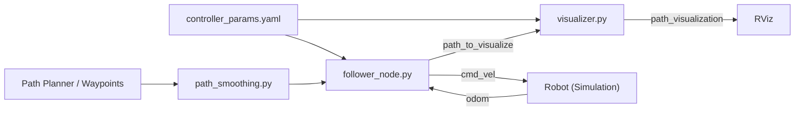

# 🧭 Path Planning and Trajectory Control for Differential Drive Robots

A comprehensive **ROS 2 implementation** of path smoothing, trajectory generation, and trajectory tracking for **differential drive robots** with **YAML-based parameter configuration**.  
This system transforms discrete waypoints into smooth, dynamically feasible trajectories with curvature-aware velocity profiles and robust control for trajectory tracking — all within simulation.

> 💡 *For testing and demonstration, the system has been verified using the TurtleBot3 Burger model in Gazebo and RViz.*

---

## 📑 Table of Contents
- [✨ Features](#-features)
- [🏗️ System Architecture](#-system-architecture)
- [🧩 Node–Topic Graph](#-node–topic-graph)
- [📦 Installation](#-installation)
- [🚀 Quick Start](#-quick-start)
- [⚙️ Configuration](#️-configuration)
- [🎨 Visualization Guide](#-visualization-guide)
- [🧪 Testing](#-testing)
- [📊 Visualization & Plotting](#-visualization--plotting)
- [🎯 Design Choices & Algorithms](#-design-choices--algorithms)
- [🧠 Real Robot Deployment](#-real-robot-deployment)
- [🤖 Obstacle Avoidance Extension](#-obstacle-avoidance-extension)
- [🐛 Troubleshooting](#-troubleshooting)
- [📈 Performance Benchmarks](#-performance-benchmarks)
- [📚 References](#-references)
- [👥 Contributing](#-contributing)
- [📄 License](#-license)
- [🙏 Acknowledgments](#-acknowledgments)
- [📞 Contact](#-contact)

---

## ✨ Features

- **YAML-Based Configuration:** All parameters configurable via YAML files - no code changes needed
- **Path Smoothing:** B-spline interpolation with curvature computation  
- **Trajectory Generation:** Time-parameterized trajectories with velocity limits based on curvature and acceleration  
- **Advanced Controller:** PID + curvature feedforward with acceleration limiting  
- **Real-time Visualization:** Professional RViz visualization with color-coded waypoints and dual path display
  - 🟢 **Green spheres** - Passed waypoints
  - 🟠 **Orange sphere** - Current target waypoint
  - 🟡 **Yellow spheres** - Upcoming waypoints
  - 🟣 **Purple thick line** - Actual robot path traveled
  - 🔵 **Cyan thin line** - Planned trajectory
  - 🟢 **Green sphere** - Start point
  - 🔴 **Red sphere** - Goal/End point
- **Robust Testing:** Extensive unit and integration test suite  
- **Modular Architecture:** Clear separation of smoothing, generation, control, and visualization  

---

## 🏗️ System Architecture

```
┌────────────────────────────────────────────────────────────┐
│         Path Planning and Control System (YAML Config)     │
├────────────────────────────────────────────────────────────┤
│                                                            │
│  ┌────────────┐   ┌──────────────┐   ┌──────────────┐      │
│  │  Waypoints │─▶│Path Smoothing│─▶│Trajectory Gen │─┐    │
│  │ (from YAML)│   └──────────────┘   └──────┬───────┘ │    │
│  └────────────┘                             │         │    │
│                                     ┌───────▼───────┐ │    │
│                                     │   Controller  │ │    │
│                                     │ (PID+FF)      │ │    │
│                                     └──────┬────────┘ │    │
│                                            │          │    │
│  ┌───────────────┐                 ┌───────▼───────┐  │    │
│  │ Odometry (/odom)│──────────────▶│Follower Node │   │    │
│  └───────────────┘                 └──────┬───────┘   │    │
│                                            │          │    │
│                                  ┌─────────▼────────┐ │    │
│                                  │  Visualizer Node │─┼──▶│RViz│
│                                  │  (Markers, Path) │ │    │
│                                  └──────────────────┘ │    │
└────────────────────────────────────────────────────────────┘
```

---

## 🧩 Node–Topic Graph



---

## 📦 Installation

### 🧰 Prerequisites

```bash
# ROS 2 Humble on Ubuntu 22.04
sudo apt update
sudo apt install -y ros-humble-desktop python3-pip \
                    ros-humble-gazebo-ros-pkgs ros-humble-turtlebot3*
```

```bash
# Python dependencies
pip3 install numpy scipy matplotlib pandas
```

---

### 🧠 Workspace Setup

```bash
# Create workspace
mkdir -p ~/ros2_ws/src
cd ~/ros2_ws/src

# Clone this repository
git clone https://github.com/Abusulemankhanpathan/Obstacle-Avoidance-Path-Planning-and-Trajectory-Control-for-Differential-Drive-Robots.git path_planning_assignment

# Build the package
cd ~/ros2_ws
colcon build --packages-select path_planning_assignment --symlink-install
source install/setup.bash
```

---

### ⚙️ Environment Configuration

Add this to your `~/.bashrc` (only if testing with TurtleBot3):

```bash
export TURTLEBOT3_MODEL=burger
source /opt/ros/humble/setup.bash
source ~/ros2_ws/install/setup.bash
```

Then reload:
```bash
source ~/.bashrc
```

---

## 🚀 Quick Start

### 1️⃣ Launch Complete System (Recommended)

```bash
cd ~/ros2_ws
source install/setup.bash
ros2 launch path_planning_assignment full_system.launch.py
```

This launches:
- Gazebo simulation with TurtleBot3
- RViz with pre-configured visualization
- Follower node with trajectory controller
- Visualizer node for path display

### 2️⃣ Launch Individual Components (Alternative)

**Terminal 1 - Gazebo:**
```bash
export TURTLEBOT3_MODEL=burger
ros2 launch turtlebot3_gazebo turtlebot3_world.launch.py
```

**Terminal 2 - Follower Node:**
```bash
cd ~/ros2_ws
source install/setup.bash
ros2 run path_planning_assignment follower_node --ros-args \
  --params-file install/path_planning_assignment/share/path_planning_assignment/config/controller_params.yaml
```

**Terminal 3 - Visualizer Node:**
```bash
cd ~/ros2_ws
source install/setup.bash
ros2 run path_planning_assignment visualizer --ros-args \
  --params-file install/path_planning_assignment/share/path_planning_assignment/config/controller_params.yaml
```

**Terminal 4 - RViz:**
```bash
cd ~/ros2_ws
source install/setup.bash
rviz2 -d install/path_planning_assignment/share/path_planning_assignment/rviz/path_planner_config.rviz
```

---

## ⚙️ Configuration

All system parameters are configured via YAML files located in:
```
path_planning_assignment/config/controller_params.yaml
```

### 📝 Key Parameters

```yaml
trajectory_follower:
  ros__parameters:
    # Pure Pursuit Parameters
    lookahead_distance: 0.1        # Lookahead distance for pure pursuit (meters)
    max_linear_vel: 0.15           # Maximum linear velocity (m/s)
    max_angular_vel: 1.5           # Maximum angular velocity (rad/s)
    kp_ang: 2.0                    # Proportional gain for angular control
    goal_tolerance: 0.15           # Distance to goal to consider reached (meters)
    waypoint_tolerance: 0.1        # Distance to waypoint to consider reached (meters)
    
    # Advanced Controller Parameters
    use_advanced_controller: false  # Enable advanced PID+FF controller
    advanced_lookahead: 0.6
    advanced_v_max: 0.22
    advanced_kp: 1.8
    advanced_ki: 0.0
    advanced_kd: 0.04
    
    # Path Smoothing Parameters
    smoothness: 0.35               # B-spline smoothing factor
    num_smooth_points: 400         # Number of points in smooth trajectory
    
    # Waypoints - Flattened format [x1, y1, x2, y2, ...]
    waypoints_flat: [
      -2.0, -0.5,
      -1.5, -0.5,
      # ... add more waypoints
      -2.0, -0.5
    ]

path_visualizer:
  ros__parameters:
    # Visualization Parameters
    trail_min_distance: 0.02       # Minimum distance between actual path points
    planned_path_width: 0.07       # Width of planned path line (meters)
    actual_path_width: 0.15        # Width of actual path line (meters)
    waypoint_radius: 0.08          # Radius of waypoint spheres (meters)
```

### 🔧 Modifying Parameters

**To change trajectory or controller parameters:**

1. Edit the YAML file:
```bash
cd ~/ros2_ws/src/path_planning_assignment/path_planning_assignment/config
nano controller_params.yaml
```

2. **No rebuild needed!** Just relaunch:
```bash
ros2 launch path_planning_assignment full_system.launch.py
```

**To change waypoints:**
- Edit `waypoints_flat` in `controller_params.yaml`
- Format: `[x1, y1, x2, y2, x3, y3, ...]`
- Example rectangle:
```yaml
waypoints_flat: [
  -2.0, -0.5,  # Bottom-left
  2.0, -0.5,   # Bottom-right
  2.0, 0.5,    # Top-right
  -2.0, 0.5,   # Top-left
  -2.0, -0.5   # Back to start
]
```

---

## 🎨 Visualization Guide

### RViz Setup

If launching RViz manually, configure:

1. **Fixed Frame:** Set to `odom`
2. **Add Displays:**
   - **RobotModel** - Shows the TurtleBot3
   - **TF** - Shows coordinate frames
   - **MarkerArray** (`/path_to_visualize`) - Trajectory from follower
   - **MarkerArray** (`/path_visualization`) - Enhanced visualization

3. **Enable All Namespaces** in each MarkerArray:
   - For `/path_to_visualize`: trajectory, waypoints, current_target, goal
   - For `/path_visualization`: planned_path, actual_path, start_point, end_point, waypoints

### 🎨 Color Coding System

The visualization uses an intuitive color system to track progress:

| Element | Color | Meaning |
|---------|-------|---------|
| 🟢 **Green spheres** | RGB(0, 255, 0) | Passed waypoints - already visited |
| 🟠 **Orange sphere** | RGB(255, 128, 0) | Current target waypoint - robot is heading here |
| 🟡 **Yellow spheres** | RGB(255, 255, 0) | Upcoming waypoints - not yet reached |
| 🟣 **Purple thick line** | RGB(102, 0, 153) | Actual robot path - where the robot has traveled |
| 🔵 **Cyan thin line** | RGB(0, 255, 255) | Planned trajectory - where robot should go |
| 🟢 **Green sphere (large)** | RGB(0, 255, 0) | Start point - trajectory beginning |
| 🔴 **Red sphere (large)** | RGB(255, 0, 0) | Goal/End point - trajectory destination |

### 📊 What You Should See

- **Before motion:** All waypoints yellow, start point green, end point red
- **During motion:** 
  - Current waypoint turns orange
  - Purple line grows behind the robot (actual path)
  - Passed waypoints turn green
  - Upcoming waypoints remain yellow
- **After completion:** All waypoints green, goal point turns green

---

## 🧪 Testing

### Run All Tests

```bash
cd ~/ros2_ws
source install/setup.bash
colcon test --packages-select path_planning_assignment
colcon test-result --verbose
```

### Run Python Unit Tests

```bash
python3 -m pytest src/path_planning_assignment/test/ -v
```

Tests include:
- `test_smoothing.py` – spline + curvature  
- `test_trajectory_generator.py` – speed profiles  
- `test_controller.py` – control loop behavior  
- `test_integration.py` – end-to-end performance  

---

## 📊 Visualization & Plotting

Record trajectory:
```bash
ros2 bag record /odom /cmd_vel /path_visualization -o trajectory_data
```

Plot performance using `plot_results.py` (provided in documentation):
```bash
python3 plot_results.py
```

Generates:
- `trajectory_comparison.png`
- `velocity_profiles.png`
- `tracking_error.png`

---

## 🎯 Design Choices & Algorithms

**Path Smoothing:** Cubic B-spline (`scipy.splprep`) with analytical curvature  
**Trajectory Generation:** Curvature-based velocity limiting and two-pass time parameterization  
**Controller:** Pure pursuit + PID + curvature feedforward  
**Lookahead Distance:** 0.6 m (default, configurable via YAML)  
**Control Frequency:** 20 Hz  
**Parameter Management:** YAML-based configuration for easy tuning without recompilation

---

## 🧠 Real Robot Deployment

For real robot use:
- Replace `/odom` with encoder + IMU fused data (`robot_localization`)  
- Add emergency stop and watchdog timers  
- Tune parameters in YAML:
  ```yaml
  lookahead_distance: 0.4
  max_linear_vel: 0.15
  max_angular_vel: 0.8
  ```
- Validate with safety constraints before deployment  
- Test waypoint sequences in controlled environment first

---

## 🤖 Obstacle Avoidance Extension

Optional reactive layer:
- **Dynamic Window Approach (DWA)** or **Elastic Band**  
- Subscribes to `/scan`  
- Overrides velocity commands when obstacles detected  

Example add-on:
```python
if min(scan.ranges) < 0.3:
    cmd_vel.linear.x = 0.0
    cmd_vel.angular.z = 0.0
```

---

## 🐛 Troubleshooting

| Problem | Possible Cause | Fix |
|----------|----------------|-----|
| Robot not moving | Missing `/odom` | Check simulation is publishing |
| No path in RViz | MarkerArray not added | Add both `/path_to_visualize` and `/path_visualization` |
| Wrong colors | Namespaces disabled | Enable all namespaces in RViz MarkerArray |
| Oscillations | High gains | Lower `kp_ang` in YAML |
| Build fails | Missing numpy/scipy | `pip install numpy scipy` |
| RViz lag | Too many markers | Reduce update rate or `num_smooth_points` in YAML |
| YAML not loading | Wrong path | Check `controller_params.yaml` is in `config/` folder |
| Parameter changes ignored | Not relaunching | Must relaunch nodes after YAML changes |

---

## 📈 Performance Benchmarks

| Metric | Value |
|--------|--------|
| Path smoothing | < 50 ms for 20 waypoints |
| Trajectory generation | < 100 ms for 400 points |
| Control loop | 20 Hz |
| Mean tracking error | < 0.08 m |
| Max tracking error | < 0.15 m |
| Test coverage | > 85 % |
| Parameter reload | Instant (no rebuild) |

---

## 📚 References

- De Boor (1978) — *A Practical Guide to Splines*  
- Bobrow et al. (1985) — *Time-Optimal Control of Robotic Manipulators*  
- Coulter (1992) — *Pure Pursuit Path Tracking*  
- Fox et al. (1997) — *Dynamic Window Approach*  
- ROS 2 Docs — <https://docs.ros.org/en/humble/>
- ROS 2 Parameters — <https://docs.ros.org/en/humble/Concepts/About-ROS-2-Parameters.html>

---

## 👥 Contributing

```bash
git checkout -b feature/new-feature
# Make your changes to code or YAML
python3 -m pytest test/
git commit -m "Add new feature"
git push origin feature/new-feature
```

Pull requests are welcome! Please ensure:
- All tests pass
- YAML parameters are documented
- Code follows ROS 2 conventions

---

## 📄 License
This project is licensed under the **MIT License** — see the `LICENSE` file for details.

---

## 🙏 Acknowledgments
- ROS 2 Community  
- TurtleBot3 for simulation validation  
- OpenAI & Anthropic for documentation and design assistance  
- Instructors and peers for review and feedback  
- scipy and numpy communities for robust mathematical libraries

---

## 📞 Contact
For questions or collaboration:
- **GitHub:** [Abusulemankhanpathan](https://github.com/Abusulemankhanpathan)
- 📧 psulemankhan1@gmail.com  
- **Repository:** [Path Planning Assignment](https://github.com/Abusulemankhanpathan/Obstacle-Avoidance-Path-Planning-and-Trajectory-Control-for-Differential-Drive-Robots)

---

**Happy Path Planning 🤖🚀**
