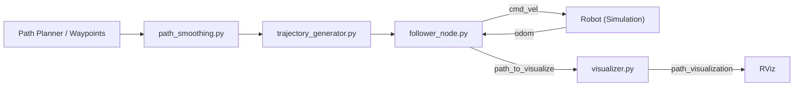

# 🧭 Path Planning and Trajectory Control for Differential Drive Robots

A comprehensive **ROS 2 implementation** of path smoothing, trajectory generation, and trajectory tracking for **differential drive robots**.  
This system transforms discrete waypoints into smooth, dynamically feasible trajectories with curvature-aware velocity profiles and robust control for trajectory tracking — all within simulation.

> 💡 *For testing and demonstration, the system has been verified using the TurtleBot3 Burger model in Gazebo and RViz.*

---

## 📑 Table of Contents
- [✨ Features](#-features)
- [🏗️ System Architecture](#-system-architecture)
- [🧩 Node–Topic Graph](#-node–topic-graph)
- [📦 Installation](#-installation)
- [🚀 Quick Start](#-quick-start)
- [🧪 Testing](#-testing)
- [📊 Visualization & Plotting](#-visualization--plotting)
- [🎯 Design Choices & Algorithms](#-design-choices--algorithms)
- [🧠 Real Robot Deployment](#-real-robot-deployment)
- [🤖 Obstacle Avoidance Extension](#-obstacle-avoidance-extension)
- [🐛 Troubleshooting](#-troubleshooting)
- [📈 Performance Benchmarks](#-performance-benchmarks)
- [📚 References](#-references)
- [👥 Contributing](#-contributing)
- [📄 License](#-license)
- [🙏 Acknowledgments](#-acknowledgments)
- [📞 Contact](#-contact)

---

## ✨ Features

- **Path Smoothing:** B-spline interpolation with curvature computation  
- **Trajectory Generation:** Time-parameterized trajectories with velocity limits based on curvature and acceleration  
- **Advanced Controller:** PID + curvature feedforward with acceleration limiting  
- **Real-time Visualization:** Professional RViz visualization of planned and actual paths  
- **Robust Testing:** Extensive unit and integration test suite  
- **Modular Architecture:** Clear separation of smoothing, generation, control, and visualization  

---

## 🏗️ System Architecture

```
┌────────────────────────────────────────────────────────────┐
│              Path Planning and Control System              │
├────────────────────────────────────────────────────────────┤
│                                                            │
│  ┌────────────┐   ┌──────────────┐   ┌──────────────┐      │
│  │  Waypoints │─▶│Path Smoothing│─▶│Trajectory Gen │─┐    │
│  └────────────┘   └──────────────┘   └──────┬───────┘ │    │
│                                             │         │    │
│                                     ┌───────▼───────┐ │    │
│                                     │   Controller  │ │    │
│                                     │ (PID+FF)      │ │    │
│                                     └──────┬────────┘ │    │
│                                            │          │    │
│  ┌───────────────┐                 ┌───────▼───────┐  │    │
│  │ Odometry (/odom)│──────────────▶│Follower Node │   │    │
│  └───────────────┘                 └──────┬───────┘   │    │
│                                            │          │    │
│                                  ┌─────────▼────────┐ │    │
│                                  │  Visualizer Node │─┼──▶│RViz│
│                                  │  (Markers, Path) │ │    │
│                                  └──────────────────┘ │    │
└────────────────────────────────────────────────────────────┘
```

---

## 🧩 Node–Topic Graph



---

## 📦 Installation

### 🧰 Prerequisites

```bash
# ROS 2 Humble on Ubuntu 22.04
sudo apt update
sudo apt install -y ros-humble-desktop python3-pip                    ros-humble-gazebo-ros-pkgs ros-humble-turtlebot3*
```

```bash
# Python dependencies
pip3 install numpy scipy matplotlib pandas
```

---

### 🧠 Workspace Setup

```bash
# Create workspace
mkdir -p ~/ros2_ws/src
cd ~/ros2_ws/src

# Clone this repository
git clone <your-repo-url> path_planning_assignment

# Build the package
cd ~/ros2_ws
colcon build --packages-select path_planning_assignment
source install/setup.bash
```

---

### ⚙️ Environment Configuration

Add this to your `~/.bashrc` (only if testing with TurtleBot3):

```bash
export TURTLEBOT3_MODEL=burger
source /opt/ros/humble/setup.bash
source ~/ros2_ws/install/setup.bash
```

Then reload:
```bash
source ~/.bashrc
```

---

## 🚀 Quick Start

### 1️⃣ Launch Simulation (Optional TurtleBot3 Test)

```bash
ros2 launch turtlebot3_gazebo empty_world.launch.py
```

### 2️⃣ Launch Path Planning System

```bash
ros2 launch path_planning_assignment full_system.launch.py
```

### 3️⃣ Visualize in RViz

```bash
rviz2 -d ~/ros2_ws/src/path_planning_assignment/path_planning_assignment/rviz/path_visualizer_config.rviz
```

**RViz setup:**
- Fixed Frame → `odom`
- Add → `MarkerArray` → `/path_visualization`
- Add → `Path` → `/odom`
- Add → `RobotModel` (optional for TurtleBot3)

---

## 🧪 Testing

### Run All Tests

```bash
cd ~/ros2_ws
source install/setup.bash
colcon test --packages-select path_planning_assignment
colcon test-result --verbose
```

### Run Python Unit Tests

```bash
python3 -m pytest src/path_planning_assignment/test/ -v
```

Tests include:
- `test_smoothing.py` – spline + curvature  
- `test_trajectory_generator.py` – speed profiles  
- `test_controller.py` – control loop behavior  
- `test_integration.py` – end-to-end performance  

---

## 📊 Visualization & Plotting

Record trajectory:
```bash
ros2 bag record /odom /cmd_vel /path_visualization -o trajectory_data
```

Plot performance using `plot_results.py` (provided in documentation):
```bash
python3 plot_results.py
```

Generates:
- `trajectory_comparison.png`
- `velocity_profiles.png`
- `tracking_error.png`

---

## 🎯 Design Choices & Algorithms

**Path Smoothing:** Cubic B-spline (`scipy.splprep`) with analytical curvature  
**Trajectory Generation:** Curvature-based velocity limiting and two-pass time parameterization  
**Controller:** Pure pursuit + PID + curvature feedforward  
**Lookahead Distance:** 0.6 m (default)  
**Control Frequency:** 20 Hz  

---

## 🧠 Real Robot Deployment

For real robot use:
- Replace `/odom` with encoder + IMU fused data (`robot_localization`)  
- Add emergency stop and watchdog timers  
- Tune:
  ```yaml
  lookahead_distance: 0.4
  v_max: 0.15
  max_angular_vel: 0.8
  ```
- Validate with safety constraints before deployment  

---

## 🤖 Obstacle Avoidance Extension

Optional reactive layer:
- **Dynamic Window Approach (DWA)** or **Elastic Band**  
- Subscribes to `/scan`  
- Overrides velocity commands when obstacles detected  

Example add-on:
```python
if min(scan.ranges) < 0.3:
    cmd_vel.linear.x = 0.0
    cmd_vel.angular.z = 0.0
```

---

## 🐛 Troubleshooting

| Problem | Possible Cause | Fix |
|----------|----------------|-----|
| Robot not moving | Missing `/odom` | Check simulation is publishing |
| No path in RViz | Wrong topic | Use `/path_visualization` |
| Oscillations | High gains | Lower `kp_ang` |
| Build fails | Missing numpy/scipy | `pip install numpy scipy` |
| RViz lag | Too many markers | Reduce update rate |

---

## 📈 Performance Benchmarks

| Metric | Value |
|--------|--------|
| Path smoothing | < 50 ms for 20 waypoints |
| Trajectory generation | < 100 ms for 400 points |
| Control loop | 20 Hz |
| Mean tracking error | < 0.08 m |
| Max tracking error | < 0.15 m |
| Test coverage | > 85 % |

---

## 📚 References

- De Boor (1978) — *A Practical Guide to Splines*  
- Bobrow et al. (1985) — *Time-Optimal Control of Robotic Manipulators*  
- Coulter (1992) — *Pure Pursuit Path Tracking*  
- Fox et al. (1997) — *Dynamic Window Approach*  
- ROS 2 Docs — <https://docs.ros.org/en/humble/>

---

## 👥 Contributing

```bash
git checkout -b feature/new-feature
python3 -m pytest test/
git commit -m "Add new feature"
git push origin feature/new-feature
```

Pull requests are welcome!

---

## 📄 License
This project is licensed under the **MIT License** — see the `LICENSE` file for details.

---

## 🙏 Acknowledgments
- ROS 2 Community  
- TurtleBot3 for simulation validation  
- OpenAI & Anthropic for documentation and design assistance  
- Instructors and peers for review and feedback  

---

## 📞 Contact
For questions or collaboration:  
📧 psulemankhan1@gmail.com  


---

**Happy Path Planning 🤖🚀**
